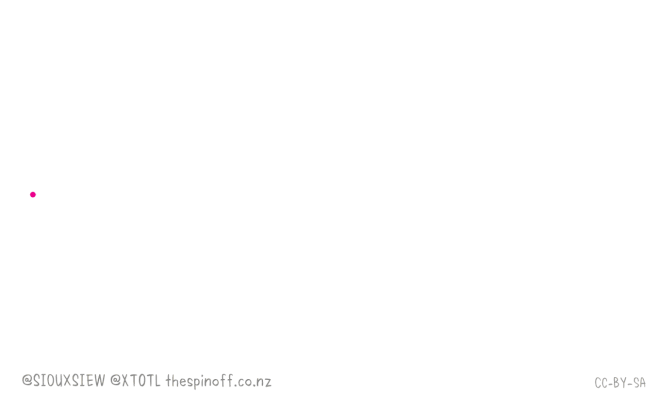

<h2 align="center">
      COVID-19 DISTANCE ASSISTANT
</h2>


A social distancing detector built with OpenCV using YOLO(COCO model) object detector


<h3 align="center">
      MOTIVATION
</h3>


<p>
Social distancing is a method used to control the spread of contagious diseases. It implies that people physically distance themselves from one another, reducing close contact, and thereby reducing the spread of a contagious disease (such as the COVID-19 Disease). Social distancing is not a new concept, dating back to the fifth century, and has even been referenced in religious text such as the Bible.
</p>

<br><br>

<p align="center">
  
</p>

<p align="center">
   Social distancing is crucial to the prevention of the spread of disease.
</p>
<br><br>

## Features :
* Object detection using the YOLO COCO model to detect only people in a video stream.
* Computes the pairwise distances between all detected people.
* Based on the computed distances, we determine whether social distancing rule is being violated or not.

<br>

## Installation :

1. Clone the repo

```bash
   $ git clone https://github.com/nishitsingh13/Covid-19_Distance_Assistant.git
   $ cd Covid-19_Distance_Assistant
```

2. Create Virtual Environment
```bash
   $ python3 -m venv venv
   $ source venv/bin/activate
```

3. Install dependencies

```bash
   $ pip install -r requirements.txt
```

4. Run the main social distancing detector file. (set display to 1 if you want to see output video as processing occurs)
```bash
   $ python social_distancing_detector.py
   $ python social_distancing_detector.py --input filename.mp4 --output output.avi --display 1     ---->  For Pre-recorded Videos
```

<br>

## Usage :
* Caution :
For most accurate results, you should calibrate your camera through intrinsic/extrinsic parameters so that you can map pixels to measurable units.
An easier alternative(but less accurate) method would be to apply triangle similarity calibaration. Both of these methods can be used to map pixels to measurable units.\
If you do not want/cannot apply camera calibration, you can still utilize the social distancing detector but you'll have to rely strictly on the pixel distances, which won't necessarily be accurate.
For the sake of simplicity, this OpenCV Social Distancing detector implementation will rely on pixel distances. 
You can extend the implementation as you see fit though :wink:.

* YOLO COCO weights\
The weight file exceeds the github limits but can be download from <a href="https://pjreddie.com/media/files/yolov3.weights">Download From Here</a>.\
Add the weight file to the yolo-coco folder.

* GPU\
Provided you already have OpenCV installed with NVIDIA GPU support, all you need to do is set ```USE_GPU=True``` in your ```config.py``` file.

<br>


## Demo :
 

<br>

## References :
* <a href="https://en.wikipedia.org/wiki/Social_distancing">Social Distancing</a>
* <a href="https://www.reddit.com/r/computervision/comments/gf4zhj/automatic_social_distance_measurement/">Automatic social distance measurement</a>
* <a href="https://www.linkedin.com/feed/update/urn%3Ali%3Aactivity%3A6661455400346492928/">Rohit Kumar Srivastava’s social distancing implementation</a>
* <a href="https://www.linkedin.com/feed/update/urn%3Ali%3Aactivity%3A6655464103798157312/">Venkatagiri Ramesh’s social distancing project</a>

<br>

## Todos :
* Utilize proper camera calibration.
* Apply top-down transformation of view angle.
* Improve the poeple detection process.
